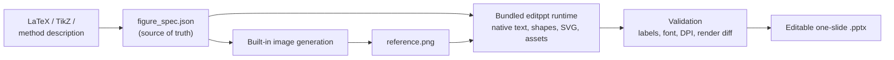

<div align="center">
  
  <h1>Research Figure Drawer</h1>
  <p><b>Turn a method description — or raw LaTeX/TikZ — into a publication-ready figure <i>and</i> a fully editable PowerPoint.</b></p>
  <p>
    <a href="LICENSE"></a>
    <a href="https://github.com/AdjacentGarden/figure_drawer/stargazers"></a>
    <a href="https://github.com/AdjacentGarden/figure_drawer/commits/main"></a>
    
    
    
    
  </p>
</div>

<br/>

> [!IMPORTANT]
> **One skill, zero external dependencies.** The editable-PPT reconstruction runtime (`editppt`), its contract,
> its references, and its page-worker template are vendored inside `skills/research-figure-drawer/cli` and
> pinned to an upstream commit. Installing this skill is enough — you do **not** need to install
> `image-to-editable-ppt` separately. See [Vendored components](#-vendored-components).

Image generators produce beautiful figures that quietly corrupt labels, formulas, arrows, and module
topology. This skill fixes that by writing a machine-checkable **`figure_spec.json` before any pixels exist**
and re-using it to rebuild and validate the editable deliverable. **The generated PNG controls appearance;
the spec controls scientific meaning.**

## 📖 Table of Contents

- [✨ Why this exists](#-why-this-exists)
- [🧭 Pipeline](#-pipeline)
- [🚀 Quick start](#-quick-start)
- [💬 Usage examples](#-usage-examples)
- [📦 What you get](#-what-you-get)
- [🧪 Validation gates](#-validation-gates)
- [🖼 Raster and screenshot input](#-raster-and-screenshot-input)
- [🔬 The spec is the source of truth](#-the-spec-is-the-source-of-truth)
- [🗂 Repository layout](#-repository-layout)
- [🧩 Vendored components](#-vendored-components)
- [🔧 Requirements](#-requirements)
- [🚧 Boundaries and non-goals](#-boundaries-and-non-goals)
- [❓ FAQ](#-faq)
- [🛠 Development](#-development)
- [🤝 Contributing](#-contributing)
- [📄 License](#-license)
- [🙏 Acknowledgements](#-acknowledgements)

## ✨ Why this exists

| 😖 The usual pain | ✅ What this skill does instead |
|---|---|
| The image model invented a module that is not in your paper | Modules and groups come from `figure_spec.json`; invented modules are rejected |
| Formulas and subscripts came back subtly wrong | Formulas are re-rendered from your LaTeX, not OCR'd from pixels |
| Arrows point the wrong way, branches got merged | Every edge has a recorded endpoint, direction, and meaning |
| The "editable" PPTX is one flat screenshot | Text, containers, paths, and tables become native PowerPoint objects |
| "It looks editable" but nobody checked | Label coverage, font size, DPI, and render drift are validated by script |
| Long videos... er, long figures drift from the source | The spec, prompt, provenance, and reports are all kept in one run directory |

## 🧭 Pipeline



1. **Specify** — distill the TeX/TikZ or method text into `figure_spec.json` *before* generating anything.
2. **Draw** — the spec is compiled into a topology-aware prompt and sent to the client's built-in image tool.
3. **Rebuild** — the accepted reference PNG is reconstructed object-by-object into a real `.pptx`.
4. **Prove** — scientific, structural, quality, and render-comparison checks run before delivery.

## 🚀 Quick start

### 1. Install the skill

```bash
npx -y skills@latest add AdjacentGarden/figure_drawer \
  --skill research-figure-drawer \
  --agent codex \
  --global
```

Restart the client so skill discovery refreshes.

### 2. Prepare the bundled runtime

Python dependencies are declared in `skills/research-figure-drawer/cli/pyproject.toml`
(PyMuPDF, Pillow, openai, PyYAML, numpy, requests).

```bash
cd <skill-root>
python3 scripts/check_environment.py --strict   # runtime, dependencies, vendored-file hashes
python3 -m pip install -e cli                  # gives you the `editppt` command
editppt doctor
```

No install step? Run the runtime straight from the checkout:

```bash
python3 scripts/run_editppt.py --help
```

### 3. Ask for a figure

Attach or paste your method description, LaTeX, or TikZ source, then:

```text
$research-figure-drawer Convert this method into a CVPR-style editable PowerPoint architecture figure.
```

## 💬 Usage examples

| You want | Say |
|---|---|
| A paper architecture figure | `Turn this section of my paper into a CVPR-style architecture figure.` |
| Your existing TikZ, made presentable | `Recreate this TikZ diagram as a publication-ready figure and an editable PPTX.` |
| A pipeline / workflow diagram | `Draw my training pipeline as a left-to-right workflow figure with editable labels.` |
| A poster / slide version | `Make a 16:9 version of my method figure for a talk.` |
| A fix for a bad generation | `The encoder block is missing and one arrow is reversed — regenerate with the spec.` |

## 📦 What you get

Every run is isolated in its own timestamped directory, so nothing is overwritten:

```text
<out-root>/20260918-040650-my-figure/
├── request.md                     # your original input
├── figure_spec.json               # authoritative labels, modules, edges, formulas
├── imagegen-prompt.md             # the exact topology-aware prompt that was sent
├── reference/
│   ├── reference.png              # accepted reference image
│   └── reference-provenance.json  # backend, SHA-256, import time (no invented model id)
└── final/
    ├── figure-validation.json     # label coverage + package + dependency validation
    ├── quality-audit.json         # font size, raster DPI, vector formula/icon policy
    └── render-comparison.json     # rendered output vs accepted reference
```

Plus the deliverables themselves: the **editable `.pptx`**, the **reference PNG**, and a rendered preview.

## 🧪 Validation gates

| Layer | 🔍 Checked by | Fails when |
|---|---|---|
| Scientific | `scripts/validate_figure_run.py` | a required `exact_text` label is not native text |
| Structure | `editppt` page/deck validation | the package cannot be rebuilt from the manifest |
| Quality | `scripts/audit_figure_quality.py` | text below the minimum font size, raster below 300 DPI, a formula that should be vector |
| Text metrics | `scripts/solve_text_metrics.py` | a measured solve cannot be verified by ink IoU against the source |
| Fidelity | `scripts/compare_renders.py` | SSIM, content alignment, lost source ink, or a per-text-box check is past its threshold |

> [!NOTE]
> `compare_renders.py` is a **gate**: it exits non-zero and names `repair_targets` in source pixels, so a bad
> region gets rebuilt instead of merely noted. Its metrics are still diagnostics rather than truth — they never
> override `figure_spec.json`, and `--advisory` does not satisfy the acceptance conditions.

## 🖼 Raster and screenshot input

Screenshots have no vector source, so the figure half of this skill does not apply — the reconstruction half
does, and it is where quality is usually lost. Two additions target exactly that:

**1. Text is measured, not estimated.** The deterministic builder derives font sizes from a per-character
width table, which lands systematically smaller than the source. `solve_text_metrics.py` instead binarises each
detected line, solves the size from real glyph advance widths, rasterises the string and scores it against the
source ink by IoU, then converts the ink box into the line box the builder anchors at. Measured against
synthetic ground truth (10–40 px glyphs on a 1280×720 page):

| Method | Mean abs error | Max error |
|---|---|---|
| Width-table estimate (as shipped) | 3.05 pt | 5.82 pt |
| Width-table estimate with `font_size_source: "measured"` | 1.58 pt | 3.14 pt |
| `solve_text_metrics.py` | **0.01 pt** | 0.05 pt |

Ink placement error is 1.1 px horizontally and 1.0 px vertically (max 2.0 px), and the solved rendering matches
the source ink at IoU 0.80–0.99.

**2. The loop is closed.** A render is only accepted after it passes the gate. Tile SSIM alone is not enough:
deleting a thin text line from a mostly-white tile barely moves SSIM, so the gate adds a lost-ink channel and
per-text-box checks, and reports the regions to rebuild. Recovery is bounded at two passes, and a region that
keeps failing is reported rather than looped on.

See [`references/raster-precision.md`](skills/research-figure-drawer/references/raster-precision.md) for the
method, the thresholds, the recovery loop, and the limits worth stating honestly (font availability, low-confidence
solves, and why a full-slide raster background is not offered as a shortcut).


## 🔬 The spec is the source of truth

Abbreviated excerpt from [`examples/multimodal-method.json`](examples/multimodal-method.json):

```json
{
  "figure_type": "multimodal",
  "scientific_message": "Video and text are encoded independently, aligned through cross-modal attention, and decoded into temporal boundaries and saliency scores.",
  "modules": [
    { "id": "visual_encoder", "label": "Visual Encoder", "kind": "encoder", "group": "encoders" },
    { "id": "cross_attention", "label": "Cross-Modal Attention", "kind": "attention", "group": "decoder" }
  ],
  "edges": [
    { "id": "e3", "from": "visual_encoder", "to": "cross_attention", "label": "V", "style": "primary" }
  ],
  "exact_text": ["Video", "Visual Encoder", "Cross-Modal Attention", "V", "Q"],
  "reconstruction": { "mode": "reference-guided-hybrid", "min_font_pt": 10.0, "min_raster_dpi": 300 }
}
```

When the image and the spec disagree, the spec wins:

| Aspect | Follows |
|---|---|
| Geometry, spacing, palette, visual hierarchy | the accepted reference image |
| Text, formulas, module identity, edges, direction, semantics | `figure_spec.json` |
| Simple motifs (tensor stacks, filmstrips, grids, braces, operators) | native PowerPoint or SVG vectors |
| Genuinely complex art (photos, textures, illustrations) | independent high-resolution raster asset |

## 🗂 Repository layout

```text
.
├── skills/research-figure-drawer/
│   ├── SKILL.md                  # the single entrypoint: the 7-step contract
│   ├── agents/openai.yaml        # skill metadata for the agent UI
│   ├── assets/figure-drawer.svg  # logo
│   ├── cli/                      # vendored editppt runtime + LICENSE + VENDOR.json
│   ├── prompts/page-worker.md    # vendored page-worker template
│   ├── references/               # spec, design, QA, raster precision + vendored contracts
│   └── scripts/                  # solve, run, prompt, import, audit, gate, validate
├── examples/multimodal-method.json
├── tests/                        # unit tests, including vendored-integrity checks
├── THIRD_PARTY_NOTICES.md
└── README.md
```

## 🧩 Vendored components

The reconstruction half of the workflow is vendored so that one skill is self-sufficient:

| Component | Upstream | License |
|---|---|---|
| `skills/research-figure-drawer/cli/` (the `editppt` runtime) and the vendored reference/prompt files | [ningzimu/image-to-editable-ppt-skill](https://github.com/ningzimu/image-to-editable-ppt-skill) @ `b7be494e31a0ed56ef98716891db5474606b8cdf` | MIT, Copyright (c) 2026 ningzimu |

- Vendored files are **byte-for-byte upstream** and must not be edited in place.
- `cli/VENDOR.json` records the pinned commit and a **SHA-256 for each of the 37 vendored files**.
- `cli/LICENSE` carries the upstream MIT text, so the notice travels with the code.
- [`tests/test_vendored_integrity.py`](tests/test_vendored_integrity.py) fails on undocumented drift.
- Full attribution: [`THIRD_PARTY_NOTICES.md`](THIRD_PARTY_NOTICES.md).

## 🔧 Requirements

| Requirement | Detail |
|---|---|
| Agent runtime | Any agent that can load a skill and run shell commands (Codex/GPT desktop, or another agent with equivalent tooling) |
| Image generation | Prefers the client's built-in `image_gen.imagegen` tool — **no API key needed**. Falls back to `editppt image generate --model gpt-image-2` (Codex OAuth or an OpenAI-compatible key) only when you explicitly ask for the exact model |
| Python | 3.10+ (for the bundled runtime scripts) |
| Network | The image stage sends the figure prompt to the client's image service; editable reconstruction may also call OCR/image services |

> [!TIP]
> Running the skill in **Full Access / autonomous** mode is recommended. A run does OCR, image
> generation, file writes, and long polling; "request approval" mode tends to interrupt the middle of the
> workflow and stall a conversion.

## 🚧 Boundaries and non-goals

- 🎯 For **architecture, workflow, method, conceptual, multimodal, and training/inference figures** — not data plots and not whole slide decks.
- 🧱 Complex illustrations and semantic icons may stay as independent raster assets; their internal strokes are not editable.
- 🧮 LaTeX formulas are independently movable **rendered assets**, not native PowerPoint equations.
- 🔒 The image and OCR stages may use external services: mark confidential work local-only **before** invoking the skill (the image stage then cannot proceed as specified).
- 🤖 The built-in image tool exposes no model selector, so the skill records "client built-in generation" and never claims an unverified model ID.
- 🖼️ Output is **not guaranteed to be a pixel-perfect replica** of the reference; minor placement or asset fringes may differ.

## ❓ FAQ

<details>
<summary><b>Do I need to install <code>image-to-editable-ppt</code> as well?</b></summary>

No. It is vendored inside this skill at `skills/research-figure-drawer/cli`, pinned to a specific upstream
commit. Installing a second copy is discouraged — it would let the two halves drift apart.
</details>

<details>
<summary><b>Do I need an OpenAI API key?</b></summary>

No, not for the default path: the reference image is produced by the client's built-in image tool, which
uses your signed-in account. A key (or Codex OAuth) is only relevant for the optional exact-model fallback.
</details>

<details>
<summary><b>Why not just ask the image model to draw the figure?</b></summary>

Because image models are unreliable at exact text, formulas, and topology. Here the pixels only set the
look; every label, module, and edge is rebuilt from `figure_spec.json` and then validated.
</details>

<details>
<summary><b>Can I use the figures in a paper submission?</b></summary>

That is the intended use — the visual design reference targets CVPR/NeurIPS/ICLR/ICML/ACL-style two-column
figures. Always inspect the final render at full size: the scripts check structure and quality, not
scientific correctness of your claims.
</details>

<details>
<summary><b>What if the generated reference is scientifically wrong?</b></summary>

The run keeps the reference and reports the exact topology/label conflict. Localized defects get a targeted
image edit; a semantically wrong figure is regenerated (up to three full generations by default) and then
stopped rather than converted knowingly.
</details>

<details>
<summary><b>Why does <code>check_environment.py --strict</code> exit non-zero?</b></summary>

It exits non-zero when the bundled runtime, a declared Python dependency, or a vendored-file hash is
missing or changed. The JSON report names the exact problem and the install command to fix it.
</details>

## 🛠 Development

```bash
# validate the skill package (optional, requires the skill-creator helpers)
python3 ~/.codex/skills/.system/skill-creator/scripts/quick_validate.py \
  skills/research-figure-drawer

# run the test suite
python3 -m unittest discover -s tests -v

# check the environment and vendored-file integrity
python3 skills/research-figure-drawer/scripts/check_environment.py
```

When you intentionally re-vendor the runtime, refresh `cli/VENDOR.json` in the same change; otherwise the
integrity test will (correctly) fail.

## 🤝 Contributing

Issues and PRs are welcome. Useful things to keep in mind:

- Keep scientific semantics in `figure_spec.json` and its references, not in prose inside scripts.
- Do not edit vendored files in place — re-vendor and update `cli/VENDOR.json` instead.
- Add or adjust a test when you change a validation rule.
- Prefer small, focused commits with a clear rationale.

## 📄 License

[MIT](LICENSE). Vendored third-party components remain under their own licenses — see
[`THIRD_PARTY_NOTICES.md`](THIRD_PARTY_NOTICES.md).

## 🙏 Acknowledgements

- [image-to-editable-ppt](https://github.com/ningzimu/image-to-editable-ppt-skill) by
  [@ningzimu](https://github.com/ningzimu) — the editable-PPT reconstruction runtime vendored here. Its
  manifest, page-worker, and packaging contracts do the heavy lifting in step 5.
- The GPT/Codex built-in `image_gen.imagegen` tool, which makes the default reference-image path key-free.

<div align="center">
  <sub>If this saves you a night of redrawing figures, a ⭐ helps other researchers find it.</sub>
</div>
